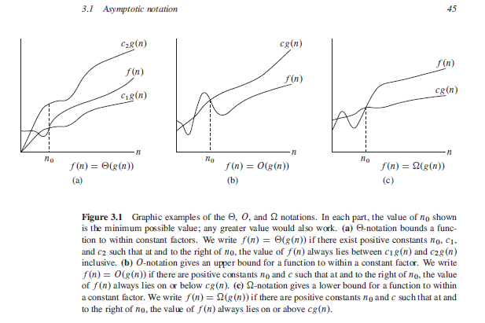

#### Asymptotic Notations

When we look at input sizes large enough to make only the order of growth of the running timr relevant, we are studying the **asymptotic** efficiency of the algorithms. That is, we are concerned  with how the runnning time of an algorithm increases with the size of the input in the limit, as the size of the input increases without bound. Usually, an algorithm that is asymptotically more efficient will be the best choice for all but very small inputs.

**$\Theta$-notation**

For a given function $g(n)$, we denote by $\Theta(g(n))$ the set of functions.

$\Theta(g(n))$ = there exists positive constants c~1~, c~2~, n~0~ such that 0<= c~1~g(n) <= f(n) <= c~2~g(n) for all n >= n~0~.

**O-notation**

The $\Theta$-notation bounds a function from above and below.When we have only an **asymptotic upper bound**, we use O-notaion. For a given function $g(n)$, we denote $O(g(n))$ the set of functions.

$O(g(n))$ = f(n) : there exists positve constants c and n~0~ such that 0<= f(n) <= cg(n) for all n >= n~0~.

**$\Omega$-notation**

Just as *O*-notation provides an asymptotic upper bound on a function, $\Omega$-notation provides an **asymptotic lower bound**.For a given function g(n), we denote by $\Omega$(g(n)) the set of functions

$\Omega(g(n)) = f(n) : there exists positive constants c and n~0~ such that 0<= cg(n) <= f(n) for all n >= n~0~.

**Explanation**

