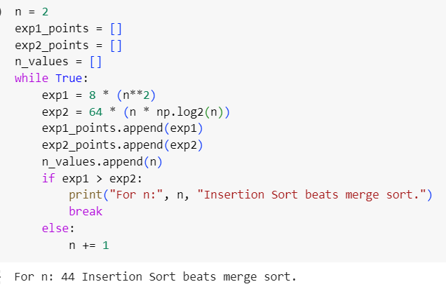
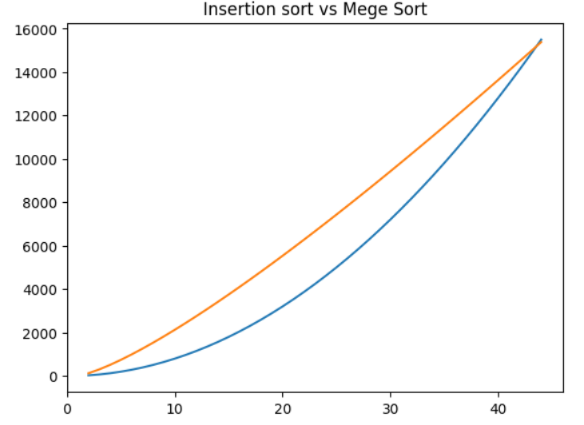
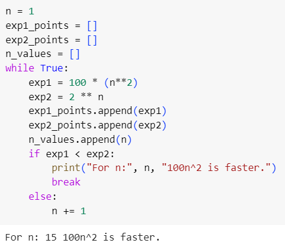
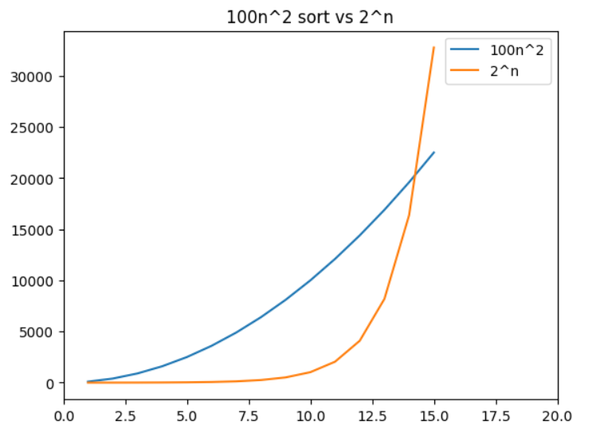

## Excercise 1.2

###### 1.2-1 Give an example of an application that requires algorithmic content at the application level, and discuss the function of the algorithms involved.

Google Maps when finding a route between two places.The algorithms are an essential part of this use case, since the route is what the user cares for the most.

###### 1.2-2 Suppose we are comparing implementations of insertion sort and merge sort on the same machine. For inputs of size n, insertion sort runs $8n^2$ steps, while merge sort runs in $64nlgn$ steps. For which values of n does insertion sort beat merge sort?

For *n* = **44**, Insertion sort takes more than Merge sort.

###### What is the smallest value of n such that an algorithm whose running time is $100n^2$ faster than an algorithm whose running time is $2^n$ on the same machine?

For *n* = **15**, $100n^2$ runs quicker than $2^n$.

