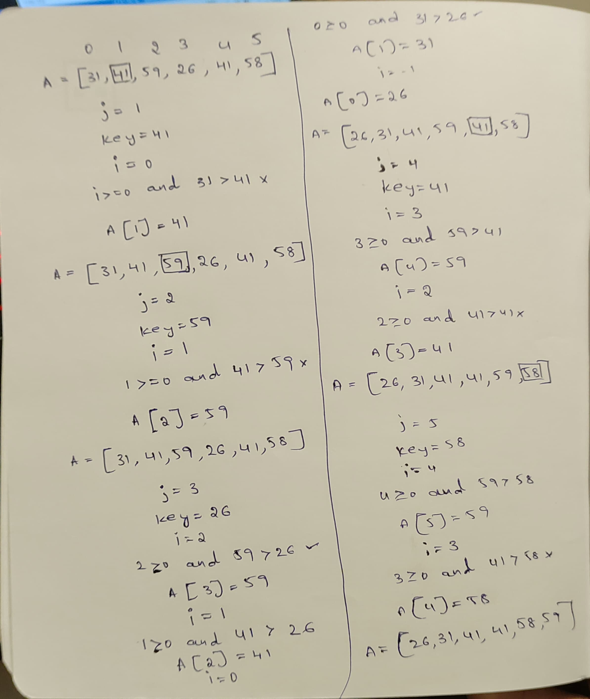

###### Excercise 2.1

###### 2.1-1 Illustrate the operation of insertion sort on the array A=[31,41,59,26,41,58].



###### 2.1-2 Rewrtie the INSERTION-SORT procedure to sort into nonincreasing instead of non decreasing order.

##### Pseudocode

```
INSERTION-SORT(A)
1 for j =2 to A.length
2    key = A[j]
3    // Insert A[j] into the sorted sequence of A[1..j-1]
4    i = j - 1
5    while i > 0 and A[i] <  key
6        A[i+1] = A[i]
7        i = i-1
8    A[i+1] = key
```
###### 2.1-3 Consider the ***Searching Problem***:

**Input:** A sequence of numbers A = [a1, a2, ..., an] and a value **v**.

**Output**: An index i such that **v**  or the special value **NIL** if **v** does not
appear in A.

Write pseudocode for **linear search**, which scans through the sequence, looking
for **v**. Using a loop invariant, prove that your algorithm is correct. Make sure that
your loop invariant fulfills the three necessary properties.

##### Pseudocode

```
Linear-Search(A, v)
index = 'NIL'
1 for i = 1 to A.length
2    if A[i] == v
3        index = i
4        break
5 return index
 ```

###### Loop Invariants for Liear Search

**Initialization:**

- At the beginning (before the loop), the loop invariant is that no elements have been examined, so the index i is set to 1.
- The search has not found the target value v yet, so you can indicate that the result is 'NIL' at this stage.

**Maintenance:**

- After each iteration of the loop, the loop invariant is that the algorithm has correctly examined the elements in A[1] through A[i-1] (i.e., all the elements before the current position).
- If the target value v hasn't been found in the examined portion, the loop invariant also indicates that the result is 'NIL' so far.

**Termination:**

- When the loop terminates, the loop invariant ensures that the algorithm has either found the target value v and returned its position or correctly determined that v is not in the array (result is 'NIL').

###### 2.1-4 Consider the problem of adding two n-bit binary integers, stored in two n-element arrays A and B. The sum of the two integers should be stored in binary form in an $n+1$ element array C. State the problem formally and write pseudocode for adding the two integers.

```
Input: bit_array1, bit_array2 (lists of bits)
Output: bit_array3 (result of bitwise addition of bit_array1 and bit_array2)

bit_array3 = empty list
flag = 0

for i = length(bit_array1) - 1 to 0 (decrementing)
    if bit_array1[i] == 1 and bit_array2[i] == 1 and flag == 0
        insert 1 at the beginning of bit_array3
        flag = 1
    else if bit_array1[i] == 0 and bit_array2[i] == 0
        insert 0 at the beginning of bit_array3
        if flag == 1
            flag = 0
    else
        if flag == 1
            insert 0 at the beginning of bit_array3
            flag = 1
        else
            insert 1 at the beginning of bit_array3

if flag == 1
    insert 1 at the beginning of bit_array3

Output bit_array3
```

**Python code for the bitwise addition**

```python
bit_array1 = list(map(int, input().split(",")))
bit_array2 = list(map(int, input().split(",")))
bit_array3 = []

flag = 0

for i in range(len(bit_array1)-1, -1, -1):
    if(bit_array2[i] == 1 and bit_array1[i] == 1):
        bit_array3.insert(0, 0 + flag)
        flag = 1
    elif(bit_array2[i] == 0 and bit_array1[i] == 0):
        bit_array3.insert(0, 0 + flag)
        if(flag == 1):
            flag = 0
    else:
        if flag == 1:
            bit_array3.insert(0, 0)
            flag = 1
        else:
            bit_array3.insert(0, 1)
if(flag == 1):
    bit_array3.insert(0, flag)

print(bit_array3)
```
