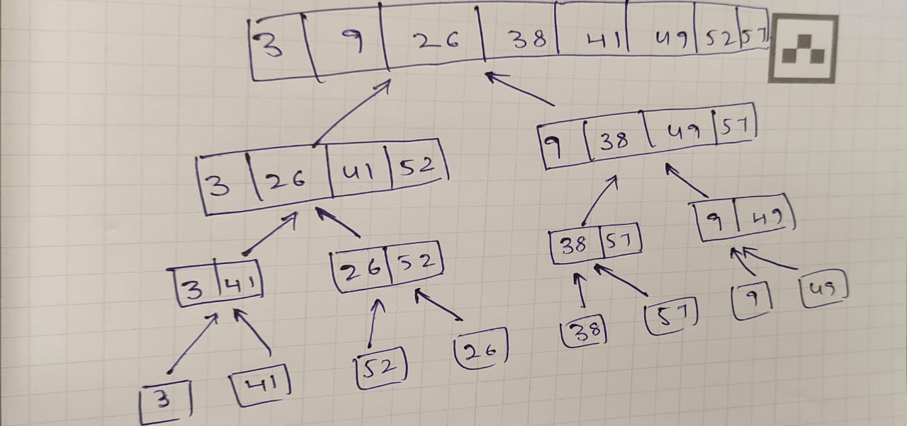

####Excercise 2.3

###### 2.3-1 Using figure illustrate the operation of merge sort on the array using A =  [3, 41, 52, 26, 38, 57, 9, 49].




###### 2.3-2 Rewrite the Merge Procedure so that it doesn't use sentinels, instead stopping once either array L or r has had all its elements copied back to A and then copying the remainder of the other array back into A.

```
MERGE(A, p, q, r)
1 n1 = q - p +1
2 n2 = r - q
3 let L[1..n1] and R[1..n2] be new arrays
4 for i = 1 to n1
5    L[i] = A[p+i-1]
6 for j = 1 to n2
7    R[j] = A[q+j]
8 i = 1
9 j = 1
10 k = p
11 while k <= r 
12    if i <= n1 && j <= n2 &&  L[i] <= R[j]
13        A[k] = L[i]
14        i = i + 1
15    else if j <= n2
16        A[k] = R[j]
17        j = j + 1
18    else
19        break
20    k += 1
21 
22 for l = i to n1
23     A[k] = L[i]
24     i += 1
25     k += 1
26 for r = j to n2
27     A[k] = R[j]
28     j += 1
29     k += 1
```

###### 2.3-3 Use mathematical Induction to show that when n is an exact power of 2, the solution of recurrence $T(n) = 2 \text{ if } n = 2, 2T(n/2) + n \text{ if } n = 2^k, \text{ for } k > 1  \text{ is } T(n) = nlgn$.

**BaseCase**
when n = 2, $T(2) = 2 = 2lg2$. so the solution holds for the inital step.

**Inductive Step**
Let's assume there exists a k, greater than 1, such that $T(2^k) = 2^k lg 2^k$. we must prove that the formula holds for $k + 1$ too,i.e.$T(2^k+1) = 2^{k+1} lg 2^{k+1}$

From our recurrence Formula,
$T(2^{k+1}) = 2T(2^{k+1}/2) + 2^{k+1}$ 
= $2T(2^k) + 2.2^k$
= $2.2^klg2^k + 2.2^k$
= $2.2^k(lg2^k+1)$
= $2^{k+1}(lg2^k + lg 2)$
= $2^{k+1}lg2^{k+1}$
 
This completes the inductive step.
Since the both cases have been perfomed by mathematical induction, the statement $T(n) = nlgn$ holds for all n that are exact power of 2.

###### 2.3-4 We can express insertion sort as a recursivve procedure as follows. In order to sort A[1..n], we can recursively A[1..n-1] and then insert A[n] into the sorted array A[1..n-1].Write a recurrence for the running time of the recursive version of insertion sort.

$T(n) = 1 \text{ if } n = 1, T(n) = (n-1) + \Theta(n) \text{ if } n > 1$

###### 2.3-5 Referring back to the searching problem (see Exercise 2.1-3), observe that if the sequence A is sorted, we can check the midpoint of the sequence against $v$ and eliminate half of the sequence from further consideration. The binary search algorithm repeats this procedure, halving the size of the remaining portion of the sequence each time. Write pseudocode, either iterative or recursive, for binary search. Argue that the worst-case running time of binary search is $lg n$.

**PseudoCode**
```
BinarySearch(A, p, r, v)
1 mid = ⌊p + r / 2⌋
2 if A[mid] == v
3     return mid
4 if A[mid] < v
5     BinarySearch(A, mid+1, r, v)
6 else
7     BinarySearch(A, p, mid, v)
```

The worst case time complexity of BinarySearch is $lgn$ beacuse it divides the input array by half for every recurrsive call. At maximum it will run for $lgn$ times.

###### 2.3.6 Observe that the while loop of lines 5–7 of the INSERTION-SORT procedure in Section 2.1 uses a linear search to scan (backward) through the sorted subarray A[1..j-1]. Can we use a binary search (see Exercise 2.3-5) instead to improve the overall worst-case running time of insertion sort to ‚ $nlg n$?

This loop serves two purposes:
-  A linear search to scan (backward) through the sorted sub-array to find the proper position for key.
- Shift the elements that are greater than key towards the end to insert key in the proper position

Although we can reduce the number of comparisons by using binary search to accomplish purpose 1, we still need to shift all the elements greater than key owards the end of the array to make space for key. And this shifting of elements runs at Θ(n) time, even in average case (as we need to shift half of the elements). So, the overall worst-case running time of insertion sort will still be $\Theta(n^2)$.

###### 2.3-7 Describe a $\Theta(nlgn)$ -time algorithm that, given a set S of n integers and another integer x, determines whether or not there exist two elements in S whose sum is exactly x.