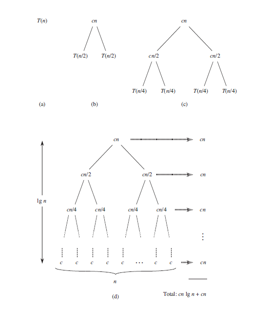

The ***merge sort*** closely follows divide and conquer approach.

**Divide:** Divide the n-element sequence to be sorted into two subsequences of n/2 elements each.

**Conquer:** Sort the two subsequenes recursively using the merge sort.

**Combine:** Merge the two sorted subsequences to produce the sorted answer..

The recursion "bottoms out" when the sequence to be sorted has length 1, in which case there is no work to be done, since every sequence of length 1 is already sorted.

The key operation of merge sort algorithm is merge procedure. It will merge the two sorted subarrays into the single array. It just woks liked pack of cards on the table. where we have two piles of cards. We compare the top card of both the piles and place the correct card in the output pile, it any of the input piles is empty we place the other pile on the output pile. It takes $\Theta(n)$ to complete this procedure.
$\infty$
**Pseudocode**

```
MERGE(A, p, q, r)
1 n1 = q - p + 1
2 n2 = r - q
3 let L[1..n1 + 1] and R[1..n2 + 1] be new arrays
4 for i = 1 to n1
5    L[i] = A[p+i-1]
6 for j = 1 to n2
7    R[j] = A[q+j]
8 L[n1 + 1] = ∞
9 R[n2 + 1] = ∞
10 i = 1
11 j = 1
12 for k = p to r
13    if L[i] <= R[j]
14        A[k] = L[i]
15        i = i + 1
16    else
17        A[k] = R[j]
18        j = j + 1 

19 Merge_Sort(A, p, r)
20 if p < r
21     q = ⌊p + r / 2⌋
22     Merge_Sort(A, p, q)
23     Merge_Sort(A, q+1, r)
24     MERGE(A, p, q, r)
```

**Python Code**

```python
import math
def merge(A, p, q, r):
    L = A[p:q]
    R = A[q:r]
    L.append(float('inf')) #appending ifinity at the end.
    R.append(float('inf')) #appending ifinity at the end.
    i = 0
    j = 0
    for k in range(p, r):
        if L[i] <= R[j]:
            A[k] = L[i]
            i += 1
        else:
            A[k] = R[j]
            j += 1

def merge_sort(A, p, r):
    if p < r-1:
        q = math.floor((p + r)/2)
        merge_sort(A, p, q)
        merge_sort(A, q, r)
        merge(A, p, q, r)
```


**Loop Invariants:** (verify Pseudocode)

At the start of each iteration of the for loop of lines 12-17, the subarrays A[p..k-1] contains the k - p smallest elements of L[1..n1 + 1] and  R[1..n2 + 1].Moreover, L[i] and R[j] are the smallest elements of their arrays that have not been v+copied back into A.

**Initialization**

Prior to the first iteration of the loop, we have k = p, so that the subarray A[p..k - 1] is empty. This empty subarray contains the k - p =  0 smallest elements of L and R, and since i = j = 1, both L[i] and R[i] are the smallest elements of their arrays that have not been copied back into A.

**Maintenance**

To see that each iteration maintains the loop invariant, let us first suppose that L[i] <= R[j]. Then [i] is the smallest element not yet copied back into A. Because A[p..k - 1] contains the k - p smallest elements, after line 14 copies L[i] into A[k], the subarray A[p..k] will contain the k- p + 1 smallest elements. Incrementing k (in the for loop update) and i (in line 15) reestablishes the loop invariant for the next iteration. If instead L[i] > R[j], then lines 16–17 perform the appropriate action to maintain the loop invariant.

**Termination**
At termination, k = r + 1. By the loop invariant, the subarray A[p..k - 1], which is A[p..r], contains the k - p = r - p + 1 smallest elements of L[1..n1 + 1] and R[1..n2 + 1], in sorted order. The arrays L and R together contain n1 + n2 + 2 = r - p + 3 elements. All but the two largest have been copied back into A, and these two largest elements are the sentinels.


**Analysis of merge sort**

We assume that the number of elements in the array is a power of 2. Even though the algorithm works well for odd number of elements.Each divide step then yields two subarrays of size exactly n/2.

We reason as follows to set up the recurrence for the $T(n)$, the worst case running time of merge sort on n numbers. Merge sort on just one  number takes constant time. When we have n > 1 elements, we break down the runnning time as follows.

**Divide:** The divide step just computes the middle of the subarray, which takes constant time. Thus, $D(n) = \Theta(1)$
**Conquer:** We recursively solve two subproblems, each of size n/2, which contributes $2T(n/2)$ to the running time.
**Combine:** We have already noted that the MERGE procedure on an n-element subarray takes time $\Theta(n)$, and so C(n) = $\Theta(n)$.

$T(n) =  \Theta(1) \text{ if } n = 1 ,  2T(n/2) + \Theta(n )  \text{ if }n > 1$.

We can soolve this recurrence relation using recurrence tree


To compute the total cost represented by the recurrence , we simply add up the costs of all the levels. The recursion tree has $lgn + 1$ levels, each costing cn, for a total cost of $cn(lgn+1)  = cn lg n + cn$. Ignoring the low-order term and the constant c gives the desired result of $\Theta(nlgn)$.